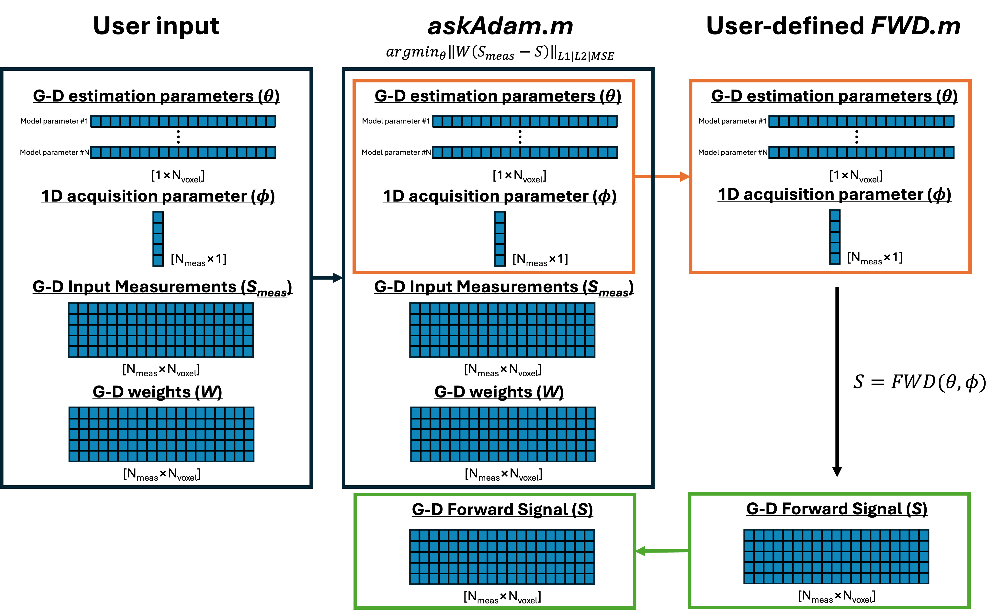
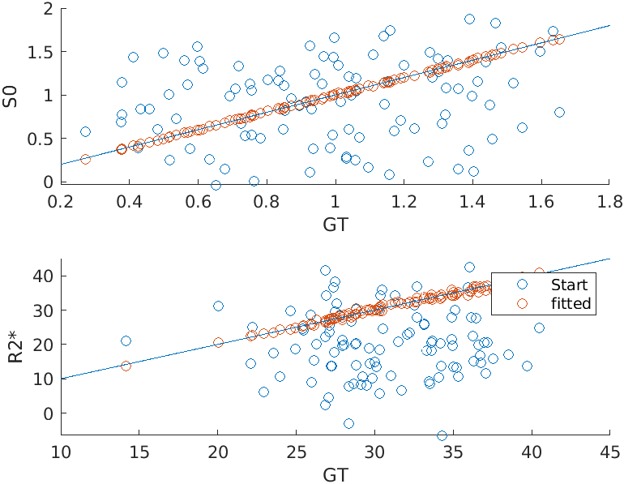

.. _gettingstarted-askadam_basic_tutorial:
.. role::  raw-html(raw)
    :format: html

askAdam basic tutorial
======================

This tutorial demonstrates an example of how to use the askAdam solver in this package for model parameter estimation, based on the G-D input option shown in here:

Let's say we have a simple monoexponential decay model:

.. math::

    S = S0 \times e^{-R_{2}^{*}t}

In this model, we have two parameters to be estimated: :math:`S0` and :math:`R_{2}^{*}`.

The first thing is to create a function to generate the forward signal. Here is an example:

.. literalinclude:: ../../examples/Example_monoexponential_FWD_GD.m
    :language: matlab
    :lines: 20-32

Note that this function takes in two input variables: **pars** and **t**, where **pars** is a structure variable stored 2 fields: **S0** and **R2star**, with a size of [1*Nvoxel], and **t** are the echo times of the measurments. The output variable **S** is a time decay signal with a size of [Nt*Nvoxel].

We can simulate the measurements using this function

.. literalinclude:: ../../examples/Example_monoexponential_estimate_askadam.m
    :language: matlab
    :lines: 4-28

Now **y** is our 'realistic' noisy data for the estimation.

.. note::
    The dimenion and arrangement of **y** must be the same as the output **S** of the forward function.

To estimate :math:`S0` and :math:`R_{2}^{*}` from **y**, 

1. Set up the starting point (**pars0**) for the estimation. **pars0** has the same input format as **pars** of the forward function. In this example, we just use random values

.. literalinclude:: ../../examples/Example_monoexponential_estimate_askadam.m
    :language: matlab
    :lines: 31-32

2. Set up the model parameters and fitting boundary.

.. literalinclude:: ../../examples/Example_monoexponential_estimate_askadam.m
    :language: matlab
    :lines: 34-39

3. Set up optimisation setting

.. literalinclude:: ../../examples/Example_monoexponential_estimate_askadam.m
    :language: matlab
    :lines: 40-47

4. Define the forward function

.. literalinclude:: ../../examples/Example_monoexponential_estimate_askadam.m
    :language: matlab
    :lines: 49-50

5. Define fitting weights (optional)

.. literalinclude:: ../../examples/Example_monoexponential_estimate_askadam.m
    :language: matlab
    :lines: 52-53

6. Start the optimisation

.. literalinclude:: ../../examples/Example_monoexponential_estimate_askadam.m
    :language: matlab
    :lines: 55-56

7. Plot the estimation results

.. literalinclude:: ../../examples/Example_monoexponential_estimate_askadam.m
    :language: matlab
    :lines: 58-64

   Scatterplots of the ground truth, starting points and estimation values

The full example script can be found in `here <../../examples/Example_monoexponential_estimate_askadam.m>`_.
    