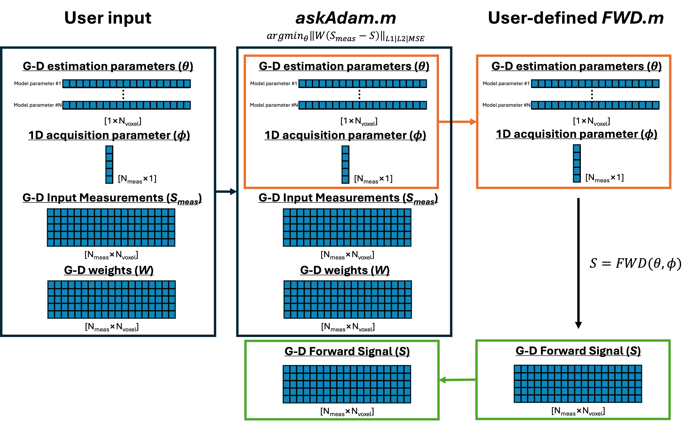
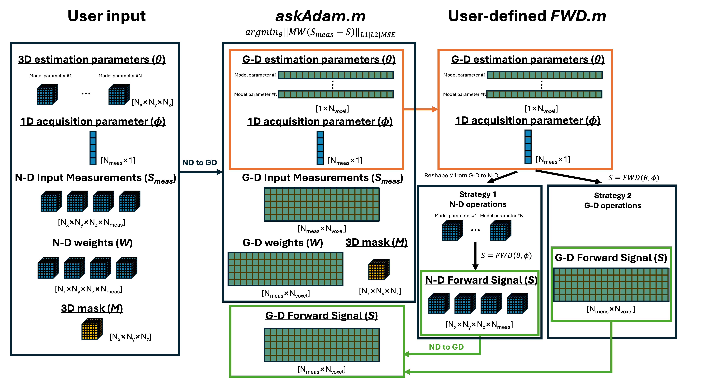

.. _gettingstarted-design_model:
.. role::  raw-html(raw)
    :format: html

Designing a new model
=====================

Design a new model for the askAdam solver
-----------------------------------------

Data I/O for askAdam
####################

Before we dive into the function design, it is useful to understand how ``askadam.m`` handles different data formats. ``askadam.m`` accepts two input formats: it can be either in G-D or N-D format.

**G-D format input**
Here is a pictorial illustration of how the data size change when using G-D format input. The operation is rather straightforward to understand: when the input data are in G-D format, no masking is applied throughout the entire optimisation process so the data size is always the same.

**N-D format input**
Here is a pictorial illustration of how the data size change when using N-D format input. To optimise the computational speed and memry usage, masking is applied internally inside the ``askadam.m`` code when N-D data are used. Note that the mask not only applies on the measurement data, but also on the estimation parameter maps along with other input data. This leads to two considerations when designing the forward model function: (1) the estimation parameters will be passed as [1*Nvoxel] arrays to the forward function, and (2) the output variable **S** needed to be in the right size to match with the masked input measurements.

We demonstrate two strategies that can be used to handle N-D data inputs. Each of them has its own merits and limitations. You can find the examples in the following section.

.. note::
    When askadam.m receives an input in N-D format (could be user input or the output from the forward function), masking will be applied automatically (i.e., all "ND to GD" operations in the figure are done inside askadam.m).

**Output format of askadam.m**
The size of the final estimation output depends on the input data format. If the input is N-D then the estimation parameters will be 2D or 3D.

Consideration on function design
################################

To take advantage of the automatic gradient computation (i.e., ``dlgradient``) from Matlab Deep Learning toolbox (so that we don't need to provide the partial derivatives for the optimisation ourselves), the input data and estimation parameters are stored as the `dlarray <https://www.mathworks.com/help/deeplearning/ref/dlarray.html>`_ in ``askadam.m``. Please check the Matlab documentation to see `the list of functions with dlarrat support <https://www.mathworks.com/help/deeplearning/ug/list-of-functions-with-dlarray-support.html>`_.

.. warning::
    It is tempting to use ``extractdata`` to pull the data out from dlarray for wider function support but this will cause error in automatic gradient computation. Instead, try approximation (e.g., ``trapz`` can be a good approximation of ``integral`` with sufficiently small spacing and supports dlarray).

What input do I need for my model function?
###########################################

In the most basic setting, we will need at least two input variables for the forward model function. The first variable is ALWAYS a structure array that contains all estimation parameters. The second variable could be any measurement parameter.

Here is an example for a simple monoexponential fitting:

.. literalinclude:: ../../examples/Example_monoexponential_FWD_GD.m
    :language: matlab
    :lines: 20-32

Here, the variable **pars** has two fields: (1) **S0** corresponds to the initial signal intensity and (2) **R2star** is a decay constant. The measurement variable ``t`` is the sampling time of the decay. We can expand the number of input variables if needed.

Note that when using the forward model function with ``askadam.m``, the data in **pars** contain only masked voxel by default. In other words, **pars.S0** and **pars.R2star** in the example above are in size of [1*Nvoxel], where Nvoxel if the number of masked voxels. The motivation of masking prior foward signal generation is to improve GPU memory and computational efficiency. For in vivo neuroimaging, the brain mask mostly accounted for only 60% of the entire volume, which means we can save 40% computational sources.

Body of the forward function
############################

When it comes to the body of the forward function we have a great flexibility in terms of design. The main requirement is that the output signal **SS** has to be with either in the G-D format (i.e., [Nmeas*Nvoxels]) or full N-D size (e.g., [Nx*Ny*Nz*Nmeas]). 

We provide 3 examples here to show how this can be done:

- If you prefer working with the G-D format see :doc:`this tutorial <askadam_basic_tutorial>`;
- If you prefer using the full N-D data, with N-D computation, see :ref:`strategy1`;
- If you prefer using the full N-D data, with the most efficient computation, see :ref:`strategy2`.

Design a new model for MCMC solver
----------------------------------

Since no gradient computation is needed for MCMC, the input data and estimation parameters are stored as `gpuArray <https://www.mathworks.com/help/parallel-computing/gpuarray.html>`_ with single precision. Here is `the list of functions with gpuArray support <https://www.mathworks.com/help/referencelist.html?type=function&capability=gpuarrays>`_.

