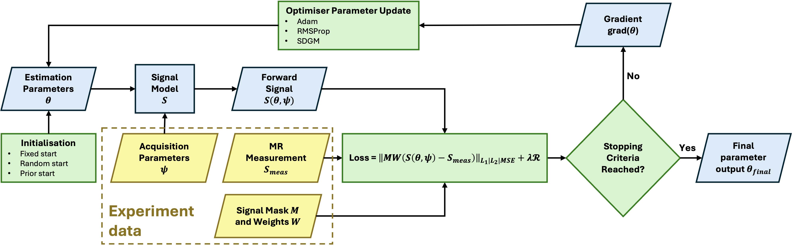

.. _gettingstarted-introduction:
.. role::  raw-html(raw)
    :format: html

Introduction
============

What is askAdam?
----------------

askAdam is a minimisation-based optimisation solver. It concatenates the entire (imaging) volume in a single optimisation problem:

.. math::

    argmin_{\theta}||MW(S_{meas}-S_{model}(\theta))||_{L1|L2|MSE}+{\lambda}R 

where :math:`M` is a mask, :math:`W` are weights, :math:`S_{meas}` are the measurements and :math:`S_{model}(\theta)` is the forward model given a parameter set :math:`\theta`, :math:`\lambda` is a regularisation parameter and :math:`R` is a regularizer(currently supports 2/3D TV regularisation). This formulation allows gradient updates for all parameters across all voxels simultaneously during the optimisation. askAdam supports 3 optimisers (Adam, RMSProp, SGDM) and 3 loss functions (L1, L2, MSE).

As shown by the equation above, askAdam is very similar to the conventioanl non-linear least square (NLLS) based optimisation. In fact, when :math:`M` contains only one voxel and loss function is set to L2, it is equivalent to NLLS. Nonetheless, when the number of voxels >1, the optimisation is different from NLLS as it will be optmising matching the forward signal model to the input measurements across the entire imaging volume instead of a single voxel.

The formulism of askAdam offers several advantages over the conventional NLLS approach:

- GPU acceleration: In each optimisation iteration, we need to generate the forward signal across the entire imaging volume simultaneously, which can be accelerated using (GPU-based) matrix operation. Every (masked) voxel contributes to the final loss. This means the estimation parameter gradients (thus parameter update) can also be computed simultaneously across all voxels, similar to the training process of a deep neural network.
- Spatial regularisation is possible: since the estimation parameter update simultaneously, it is possible to apply spatial regularisation to improve the estimation robustness by enforcing, e.g., spatial sparsity.
- Simple impementation: no partial derivatives (gradients) of the estimation parameters are required from the model developers. This is taken care by the automatic differentiation function `dlgradient <https://www.mathworks.com/help/deeplearning/ref/dlarray.dlgradient.html?searchHighlight=dlgradient&s_tid=srchtitle_support_results_1_dlgradient>`_ from Matlab. Therefore, we can focus on the forward model alone.
- Avoid overfitting by stopping optimisation early: The optimisation will stop when the loss stops improving. Since the loss is derived from the entire imaging volume, it may prevent overfitting due to local signal flutuations such as image noise or artefacts, which is common in microstructure imaging due to the high degree of freedom associated with the signal model.

Simialr to NLLS with multi-dimensionality problem, initialisation can be crucial, especially for askAdam since the final result depends not only on 1 voxel but the entire imaging volume. Also, the fitting residuals (i.e., differences between forward model and input data) are more likely to be lower with NLLS since the optimisation is customised for each voxel (whether there is overfitting is another topic).

Data dimension: G-D vs N-D
--------------------------

Throughout the documentation, we will see a lot references to the terms **G-D** and **N-D**. Here, we define **G-D** as the *GACELLE dimension*, which is a 2D array with the 1st dimension as 'measurements' and the 2nd dimension as 'voxels'(or samples). For example, if an input data :math:`S_{meas}` has 100 voxels and 5 time point measurements, :math:`S_{meas}` will be a 2D matrix with a size of [5*100]. 

In contrast, we define **N-D** as the multi-dimension array with N>=3. The first 3 dimensions of an **N-D** variable are preserved for spatial (x-,y-,z-) information, while the 4th dimension (and onwards) is for measurements. For example, :math:`S_{meas}` can be a 3D image with 10 voxels on each dimension and 5 time point measurements. Then :math:`S_{meas}` will be a 4D array with a size of [10*10*10*5]. If there is more than 1 mesaurement dimension (e.g. 2D spectrum), the dimenionality of :math:`S_{meas}` can be expanded to 5D and so on.

Introducing the concept of **G-D** lies on the fact that ``askadam.m`` takes the losses of the entire input volumn into account in the optimisation. For imaging data, we often only focus on specific tissues/organs (e.g., the brain). This requires us to apply a signal mask to exclude non-tissues-of-interest in the loss computation. **G-D** simplifies this by reducing the dimensionality of the input data into the most bacis form: all spatial information is concatenated in a single dimension (i.e., masked voxels) and the corresponding measurements in another dimension.

The utilisation of **G-D** and **N-D** is mostly relevant when it comes to designing a new forward model function. Example can be found in :doc:`the next section <designing_model>`.

