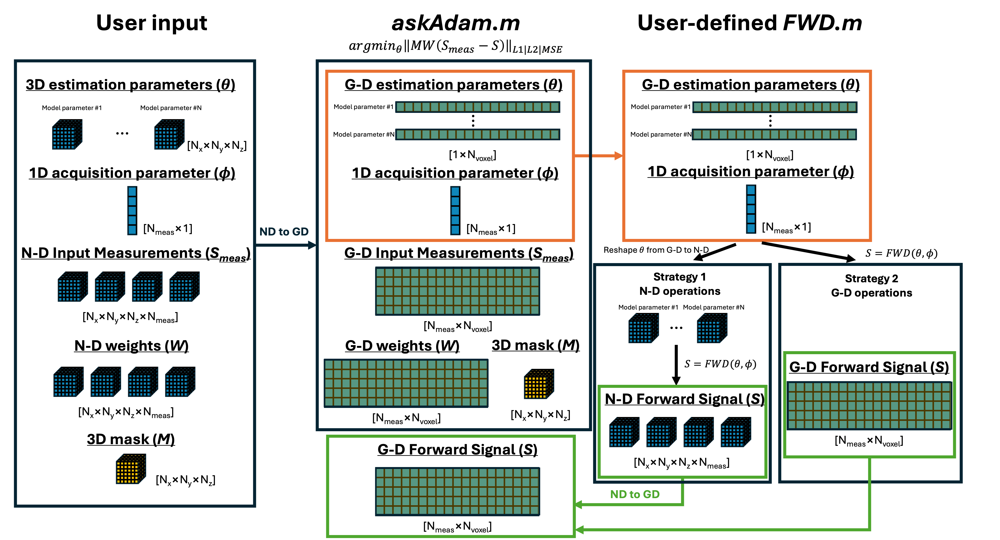
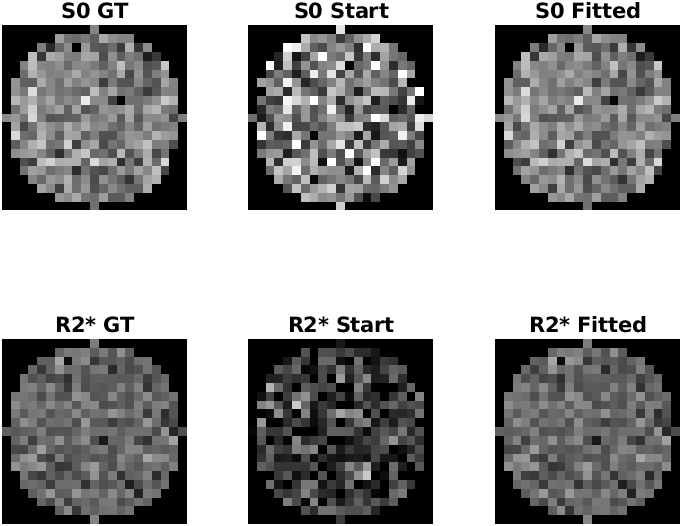
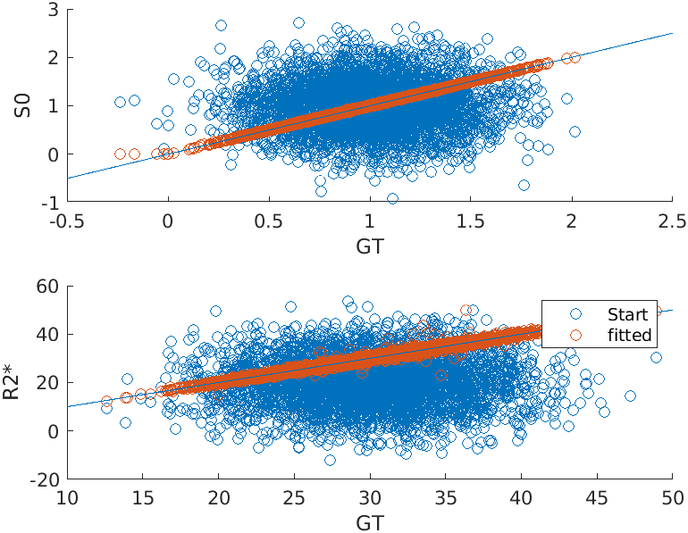

.. _tutorial-askadam_basicnd_tutorial:
.. role::  raw-html(raw)
    :format: html

askAdam basic tutorial for N-D data
===================================

This tutorial demonstrates an example of how to use the askAdam solver in this package for model parameter estimation on N-D data (N>2). Here is the overview on how data size updates during the operation. Here we focus on the FWD.m column on the figure.

Let's say we have a simple monoexponential decay model:

.. math::

    S = S0 \times e^{-R_{2}^{*}t}

In this model, we have two parameters to be estimated: :math:`S0` and :math:`R_{2}^{*}`.

.. _strategy1:

Strategy 1
----------

This strategy provides a more straightforward operation in terms of designing the signal model by making all operations N-D based. The drawback is that more GPU memory and computational power are needed.

The first thing is to create a function to generate the forward signal. To accomodate the first 3 dimensions for spatial information, we will put the time :math:`t` in the 4th dimension.

Here is an example:

.. literalinclude:: ../../examples/Example_monoexponential_FWD_askadam_3D_Strategy1.m
    :language: matlab
    :lines: 19-31

Note that the final output **S** of this forward model function is always 4D ([Nx*Ny*Nz*Nt]). When **S** is not 2D, ``askadam.m`` will automatically apply the input mask internally.

We can then simulate the 4D measurements using this function

.. literalinclude:: ../../examples/Example_monoexponential_estimate_askadam_3D_Strategy1.m
    :language: matlab
    :lines: 13-39

Now **y** is our 'realistic' noisy data for the estimation.

This time we also have a spherical non-zero mask to demonstrate the usage of a mask.

.. literalinclude:: ../../examples/Example_monoexponential_estimate_askadam_3D_Strategy1.m
    :language: matlab
    :lines: 26

To estimate :math:`S0` and :math:`R_{2}^{*}` from **y**, 

1. Set up the starting point (**pars0**) for the estimation. **pars0** has the same input format as **pars** of the forward function. In this example, we just use random values

.. literalinclude:: ../../examples/Example_monoexponential_estimate_askadam_3D_Strategy1.m
    :language: matlab
    :lines: 42-44

2. Set up the model parameters and fitting boundary

.. literalinclude:: ../../examples/Example_monoexponential_estimate_askadam_3D_Strategy1.m
    :language: matlab
    :lines: 48-51

3. Set up optimisation setting. Note that we need to set `fitting.isOptimiseMemory` to 'false' such that the signal mask does not apply to the fitting parameters `S0` and `R2star` to keep these array as their original data size (i.e., 3D in this example)

.. literalinclude:: ../../examples/Example_monoexponential_estimate_askadam_3D_Strategy1.m
    :language: matlab
    :lines: 52-57

4. Define the forward function

.. literalinclude:: ../../examples/Example_monoexponential_estimate_askadam_3D_Strategy1.m
    :language: matlab
    :lines: 59-60

5. Define fitting weights (optional)

.. literalinclude:: ../../examples/Example_monoexponential_estimate_askadam_3D_Strategy1.m
    :language: matlab
    :lines: 62-63

6. Start the optimisation

.. literalinclude:: ../../examples/Example_monoexponential_estimate_askadam_3D_Strategy1.m
    :language: matlab
    :lines: 65

7. Plot the estimation results

.. literalinclude:: ../../examples/Example_monoexponential_estimate_askadam_3D_Strategy1.m
    :language: matlab
    :lines: 67-80

   Center slice of the ground truth, starting points and estimation values

   Scatterplots of the ground truth, starting points and estimation values

The full example script can be found in `here <../../examples/Example_monoexponential_estimate_askadam_3D_Strategy1.m>`_.
    
.. _strategy2:

Strategy 2
----------

This strategy provides the most memory and computationally efficient way for the optimisation, but the operation is a bit less intuitive.

Similar to Strategy 1, the first thing is to create a function to generate the forward signal. To accomodate the first 3 dimensions for spatial information, we will put the time :math:`t` in the 4th dimension.

Here is an example:

.. literalinclude:: ../../examples/Example_monoexponential_FWD_askadam_3D_Strategy2.m
    :linenos:
    :language: matlab
    :lines: 20-43

In contrast to :doc:`the basic tutorial <askadam_basic_tutorial>`, we have some extra operations here

.. literalinclude:: ../../examples/Example_monoexponential_FWD_askadam_3D_Strategy2.m
    :language: matlab
    :lines: 32-41

This block of code is to handle the input from ``askadam.m``. As discussed in :doc:`designing a new model <designing_model>`, the estimation parameters from askAdam are already masked and reshaped into [1*Nvoxel] arrays. This block essentially has two operations: (1) checks if the estimation parameters are masked, (2) if so then reshape the output **S** to the G-D format. *GACELLE* provides a utility function ``reshape_ND2GD`` to simplify the reshaping operation of an array from the N-D size to G-D size.

Note that the idea of the function design here is a bit different from :ref:`strategy1`: In Strategy 1, we make sure the output for the forward function is (4)N-D and let ``askadam.m`` deals with the masking internally. In Strategy 2, we accepted the masked estimation parameters in G-D format from ``askadam.m`` and make sure the output **S** is also in G-D format in the optimisation process. 

Note that the size of **S** can be G-D or N-D, depending on whether the estimation parameters stired in the input variable **pars** are G-D or N-D. The output variable **S** at Line 11 is still in 4D format regardless the size of :math:`S0` and :math:`R_{2}^*`.

We can then simulate the 4D measurements using this function by using 3D :math:`S0` and :math:`R_{2}^*` input.

.. literalinclude:: ../../examples/Example_monoexponential_estimate_askadam_3D_Strategy2.m
    :language: matlab
    :lines: 14-40

Now **y** is our 'realistic' 4D noisy data for the estimation.

This time we also have a spherical non-zero mask to demonstrate the usage of a mask.

.. literalinclude:: ../../examples/Example_monoexponential_estimate_askadam_3D_Strategy2.m
    :language: matlab
    :lines: 27

To estimate :math:`S0` and :math:`R_{2}^{*}` from **y**, 

1. Set up the starting point (**pars0**) for the estimation. **pars0** has the same input structure organisation as **pars** of the forward function. It can be N-D array as the same way we generated **y**. In this example, we just use random values

.. literalinclude:: ../../examples/Example_monoexponential_estimate_askadam_3D_Strategy2.m
    :language: matlab
    :lines: 43-45

2. Set up the model parameters and fitting boundary

.. literalinclude:: ../../examples/Example_monoexponential_estimate_askadam_3D_Strategy2.m
    :language: matlab
    :lines: 49-52

3. Set up optimisation setting. Note that we set `fitting.isOptimiseMemory` back to 'true' vs Strategy 1 example

.. literalinclude:: ../../examples/Example_monoexponential_estimate_askadam_3D_Strategy2.m
    :language: matlab
    :lines: 53-58

4. Define the forward function

.. literalinclude:: ../../examples/Example_monoexponential_estimate_askadam_3D_Strategy2.m
    :language: matlab
    :lines: 60-61

5. Define fitting weights (optional)

.. literalinclude:: ../../examples/Example_monoexponential_estimate_askadam_3D_Strategy2.m
    :language: matlab
    :lines: 63-64

6. Start the optimisation

.. literalinclude:: ../../examples/Example_monoexponential_estimate_askadam_3D_Strategy2.m
    :language: matlab
    :lines: 66

7. Plot the estimation results

.. literalinclude:: ../../examples/Example_monoexponential_estimate_askadam_3D_Strategy2.m
    :language: matlab
    :lines: 68-81

   Center slice of the ground truth, starting points and estimation values

   Scatterplots of the ground truth, starting points and estimation values

These results are exactly the same as Strategy 1 because we used the same seed and mask.

The full example script can be found in `here <../../examples/Example_monoexponential_estimate_askadam_3D_Strategy2.m>`_.