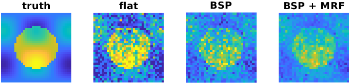

.. _tutorial-mcmc_bayes_tutorial:
.. role::  raw-html(raw)
    :format: html

Bayesian priors tutorial (mcmc_bayes)
=====================================

This tutorial fits a simulated R2* phantom three ways with the experimental ``mcmc_bayes`` sampler: with a flat prior, with a hierarchical (population) prior ("BSP"), and with the hierarchical prior plus a spatial prior. The full script is ``examples/Example_r2star_mcmc_bayes.m``; it takes about 15 minutes on a GPU. See :ref:`mcmc-bayes` for background and all options.

The model is the mono-exponential decay of :ref:`supportedmodels-R2starMapping`:

.. math::

    S(t) = M_0\, e^{-R_2^* t}

1. Simulate the data
--------------------

A 32 x 32 x 4 phantom with a 'grey matter' disc inside 'white matter' and slow spatial variation, 6 echoes and Gaussian noise:

.. literalinclude:: ../../examples/Example_r2star_mcmc_bayes.m
    :language: matlab
    :lines: 17-33

2. Common settings
------------------

``fitting.mcmcClass = 'mcmc_bayes'`` selects the Bayesian sampler in any model class. The settings below are a good starting point:

* 4 chains with over-dispersed starts, so that R-hat can be computed;
* sigmoid transform and step-size adaptation (see :ref:`mcmc-sampler-options`);
* ``'marginal_S0noise_flat'``: the noise and the amplitude ``M0`` are integrated out analytically, so the chain only explores :math:`R_2^*`.

.. literalinclude:: ../../examples/Example_r2star_mcmc_bayes.m
    :language: matlab
    :lines: 35-50

For models with several correlated parameters, also set ``fitting.adaptCovariance = true``.

3. Flat prior
-------------

Without a prior, every voxel is fitted independently:

.. literalinclude:: ../../examples/Example_r2star_mcmc_bayes.m
    :language: matlab
    :lines: 52-53

A new ``gpuR2starMapping`` object is created for every fit, because ``fit()`` adapts the object's parameter list to the solver.

4. BSP: hierarchical prior
--------------------------

``prior.hierarchical`` assumes that :math:`R_2^*` of all voxels comes from one population distribution, learned from the data together with the voxel values:

.. literalinclude:: ../../examples/Example_r2star_mcmc_bayes.m
    :language: matlab
    :lines: 55-58

For tissue made of distinct groups (e.g. iron-rich deep grey matter in vivo), ``'K', 2`` in the structure uses a two-group mixture instead.

5. BSP + spatial prior
----------------------

Adding ``prior.mrf`` couples neighbouring voxels. With a free hierarchical prior this runs two-stage empirical Bayes: stage 1 is the BSP fit above, stage 2 fixes the population prior and adds the spatial prior. ``tau`` sets the strength of the coupling (smaller = stronger):

.. literalinclude:: ../../examples/Example_r2star_mcmc_bayes.m
    :language: matlab
    :lines: 60-62

6. Results
----------

The script reports the RMSE against the truth, the coverage of the 90% credible intervals (the fraction of voxels whose interval contains the true value; 0.90 is ideal) and the median R-hat:

.. literalinclude:: ../../examples/Example_r2star_mcmc_bayes.m
    :language: matlab
    :lines: 64-72

One run of the script gave:

.. list-table::
   :widths: 25 25 25 25
   :header-rows: 1

   * - Fit
     - RMSE (1/s)
     - 90% coverage
     - R-hat
   * - flat
     - 3.10
     - 0.91
     - 1.000
   * - BSP
     - 2.59
     - 0.87
     - 1.000
   * - BSP + MRF
     - 2.19
     - 0.85
     - 1.000

The hierarchical prior reduces the voxel-to-voxel noise, and the spatial prior reduces it further. The price is visible in the disc: both priors pull atypical values slightly towards the population, which lowers the contrast and the coverage of the credible intervals a little (0.85-0.87 instead of 0.90). The priors help most when the data of one voxel determine a parameter poorly; with very informative data they change little, and for tissue that forms its own group a two-group prior (``K = 2``) reduces the shrinkage. All chains and the population prior converged (R-hat of the population mean 1.001).

7. Check convergence
--------------------

Never interpret the maps before checking that the chains converged:

.. literalinclude:: ../../examples/Example_r2star_mcmc_bayes.m
    :language: matlab
    :lines: 74-77

* ``out.diagnostics.rhat.(param)`` is the split R-hat of every voxel; values above 1.01 mean the chains disagree, and more iterations are needed.
* ``out.hyper.rhat`` is the R-hat of the population prior. It can converge more slowly than the voxels (see the warning in :ref:`mcmc-bayes`).
* ``out.hyper.mean.mu`` is the population mean in the transformed space of the parameter (here the logit of the rescaled value, since ``parameterTransform = 'sigmoid'``).

Next steps
----------

* The in vivo demos ``demo_<class>_invivo_bayes.m`` in each model folder apply the same two fits to real data. The coupled priors need the whole volume in one GPU call, so the demos fit a slab of slices.
* :ref:`api-mcmc_bayes-optimisation` lists all options.
